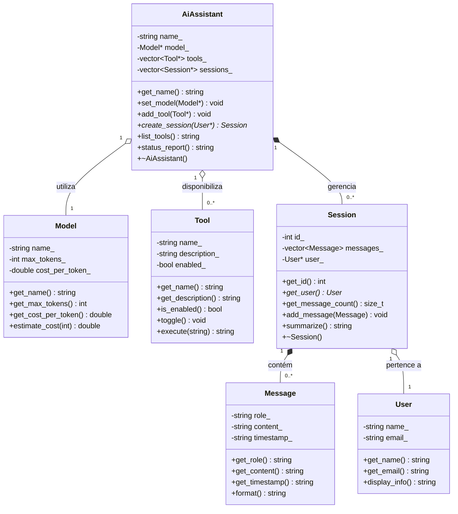

# Sistema de Serviço de LLM

**Nome:** Eduardo de Oliveira Silva
**Matrícula:** 20250018691

## Descrição do Domínio

Este projeto modela um sistema de serviço de Large Language Models (LLMs).
O sistema modela um assistente de IA baseado em LLM. Um `AiAssistant` coordena
pedidos do usuário utilizando um `Model` de linguagem e um conjunto de `Tool`s.
Cada sessão de uso (`Session`) pertence a um `User` e armazena um histórico de
`Message`s trocadas. As relações incluem composição (mensagens dentro de sessões,
ferramentas dentro do assistente) e agregação (modelo e usuário referenciados).

## Diagrama UML de Classes

## Composição e Agregação (Questão 3)

### Relações de Composição (◆)

- **AiAssistant ◆── Session**: composição — o `AiAssistant` cria as sessões internamente
  (`create_session`) e as destrói no seu destrutor (`~AiAssistant`). Uma `Session` não
  existe sem o `AiAssistant` que a criou; seu ciclo de vida é controlado inteiramente pelo dono.

- **Session ◆── Message**: composição — as mensagens são armazenadas por valor dentro do
  `vector<Message>` da `Session`. Quando a `Session` é destruída, todas as suas mensagens
  são automaticamente destruídas junto. Uma `Message` não existe fora da `Session` que a contém.

### Relações de Agregação (◇)

- **AiAssistant ◇── Model**: agregação — o `AiAssistant` apenas referencia (`Model*`) um
  modelo que existe independentemente. O destrutor do assistente **não** deleta o modelo,
  pois este pode continuar existindo após o assistente ser destruído.

- **AiAssistant ◇── Tool**: agregação — o `AiAssistant` mantém ponteiros (`vector<Tool*>`)
  para ferramentas criadas externamente. O destrutor do assistente **não** deleta as
  ferramentas, que continuam existindo de forma independente.

- **Session ◇── User**: agregação — a `Session` referencia (`User*`) um usuário que existe
  independentemente. O destrutor da sessão **não** deleta o usuário, pois este pode
  participar de outras sessões ou continuar existindo após o encerramento.
