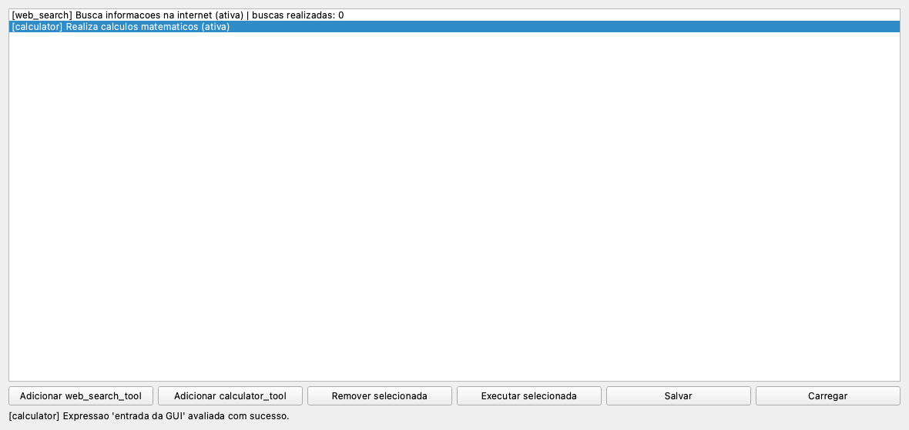

# Sistema de Serviço de LLM

**Nome:** Eduardo de Oliveira Silva
**Matrícula:** 20250018691

## Descrição do Domínio

Este projeto modela um sistema de serviço de Large Language Models (LLMs).
O sistema modela um assistente de IA baseado em LLM. Um `ai_assistant` coordena
pedidos do usuário utilizando um `model` de linguagem e um conjunto de `tool`s.
Cada sessão de uso (`session`) pertence a um `user` e armazena um histórico de
`message`s trocadas. As relações incluem composição (mensagens dentro de sessões,
ferramentas dentro do assistente) e agregação (modelo e usuário referenciados).

## Diagrama UML de Classes

```mermaid
classDiagram
    class user {
        -string name_
        -string email_
        +get_name() string
        +get_email() string
        +display_info() string
    }

    class model {
        -string name_
        -int max_tokens_
        -double cost_per_token_
        -int tokens_used_
        +get_name() string
        +get_max_tokens() int
        +get_cost_per_token() double
        +estimate_cost(int) double
        +register_usage(int) void
        +billed_cost() double
    }

    class tool {
        <<abstract>>
        -string name_
        -string description_
        -bool enabled_
        +execute(string) string*
        +cost_per_call() double*
        +describe() string
        +get_name() string
        +get_description() string
        +is_enabled() bool
        +toggle() void
        +~tool() virtual
    }

    class web_search_tool {
        -int calls_
        +execute(string) string
        +cost_per_call() double
        +describe() string
        +get_calls() int
        +billed_cost() double
    }

    class calculator_tool {
        <<final>>
        +execute(string) string
        +cost_per_call() double
    }

    class billable {
        <<interface>>
        +billed_cost() double*
    }

    class message {
        -string role_
        -string content_
        -string timestamp_
        +get_role() string
        +get_content() string
        +get_timestamp() string
        +format() string
    }

    class session {
        -int id_
        -vector~message~ messages_
        -user& user_
        +get_id() int
        +get_user() const user&
        +get_message_count() size_t
        +add_message(message) void
        +summarize() string
        +~session()
    }

    class ai_assistant {
        -string name_
        -shared_ptr~model~ model_
        -vector~shared_ptr~tool~~ tools_
        -vector~unique_ptr~session~~ sessions_
        +get_name() string
        +set_model(shared_ptr~model~) void
        +add_tool(shared_ptr~tool~) void
        +create_session(user&) session&
        +list_tools() string
        +status_report() string
        +~ai_assistant()
    }

    class catalog~T~ {
        <<template>>
        -vector~T~ items_
        +add(T) void
        +find_by_name(string) optional~T~
        +all() vector~T~
        +size() size_t
    }

    class instance_counted~Derived~ {
        <<CRTP mixin>>
        -static int count_
        +alive() int
    }

    class textual_clonable~Derived~ {
        <<CRTP mixin>>
        +clone_as_text() string
    }

    class assistant_snapshot {
        <<DTO>>
        +string assistant_name
        +model assistant_model
        +vector tools
        +operator==(assistant_snapshot) bool
    }

    class snapshot_repository {
        <<interface>>
        +save(assistant_snapshot) void*
        +load() assistant_snapshot*
    }

    class json_file_repository {
        -string path_
        +save(assistant_snapshot) void
        +load() assistant_snapshot
    }

    class memory_repository {
        -optional~assistant_snapshot~ stored_
        +save(assistant_snapshot) void
        +load() assistant_snapshot
    }

    class persistence_service {
        -snapshot_repository& repository_
        +save(ai_assistant) void
        +load() assistant_snapshot
    }

    class llm_service_error {
        <<exception>>
    }

    class model_not_found_error {
    }

    class budget_exceeded_error {
    }

    ai_assistant "1" o-- "1" model : utiliza
    ai_assistant "1" o-- "0..*" tool : disponibiliza
    ai_assistant "1" *-- "0..*" session : gerencia
    session "1" *-- "0..*" message : contém
    session "1" o-- "1" user : pertence a
    tool <|-- web_search_tool : herda
    tool <|-- calculator_tool : herda
    billable <|.. web_search_tool : implementa
    billable <|.. model : implementa

    ai_assistant "1" *-- "1" catalog : available_models_
    instance_counted <|-- message : CRTP
    instance_counted <|-- session : CRTP
    textual_clonable <|-- message : CRTP
    textual_clonable <|-- session : CRTP
    persistence_service "1" o-- "1" snapshot_repository : injeta (DIP)
    snapshot_repository <|.. json_file_repository : implementa
    snapshot_repository <|.. memory_repository : implementa
    persistence_service ..> assistant_snapshot : monta
    assistant_snapshot "1" *-- "1" model : contém
    assistant_snapshot "1" o-- "0..*" tool : referencia
    llm_service_error <|-- model_not_found_error : herda
    llm_service_error <|-- budget_exceeded_error : herda
    ai_assistant ..> llm_service_error : lança
```



## Composição e Agregação (Questão 3)

### Relações de Composição (◆)

- **ai_assistant ◆── session**: composição — o `ai_assistant` cria as sessões internamente
  (`create_session`) e as destrói no seu destrutor (`~ai_assistant`). Uma `session` não
  existe sem o `ai_assistant` que a criou; seu ciclo de vida é controlado inteiramente pelo dono.

- **session ◆── message**: composição — as mensagens são armazenadas por valor dentro do
  `vector<message>` da `session`. Quando a `session` é destruída, todas as suas mensagens
  são automaticamente destruídas junto. Uma `message` não existe fora da `session` que a contém.

### Relações de Agregação (◇)

- **ai_assistant ◇── model**: agregação — o `ai_assistant` compartilha a posse do modelo
  (`shared_ptr<model>`), que existe independentemente. O destrutor do assistente **não**
  destrói o modelo enquanto outra entidade ainda o referenciar.

- **ai_assistant ◇── tool**: agregação — o `ai_assistant` guarda
  `vector<shared_ptr<tool>>` de ferramentas criadas externamente e reutilizáveis por
  outros assistentes. O destrutor do assistente **não** destrói as ferramentas que
  ainda tiverem outros donos.

- **session ◇── user**: agregação — a `session` referencia o usuário por `user&`, um
  observador sem posse. O destrutor da sessão **não** deleta o usuário, pois este pode
  participar de outras sessões ou continuar existindo após o encerramento.

## Hierarquia de Herança (TP2 — Questão 1)

- **`tool`** é uma classe **abstrata** que define o contrato para qualquer ferramenta: `execute()` e `cost_per_call()` são métodos **puros** (virtuais sem implementação), enquanto `describe()` é **virtual não-puro** e oferece uma implementação padrão que derivadas podem estender. O **destrutor é virtual**, permitindo que derivadas executem suas lógicas de limpeza antes do destrutor da base.

- **`web_search_tool`** é uma subclasse concreta que sobrescreve todos os métodos puros e, no método `describe()`, chama explicitamente `tool::describe()` para reutilizar a descrição base antes de complementá-la com informações de estado (número de buscas realizadas).

- **`calculator_tool`** é uma subclasse concreta marcada com a palavra-chave `final` (classe folha), impedindo futuras especializações. Implementa os contratos abstratos sem estender `describe()`, usando apenas a descrição padrão da base.

## Smart Pointers (Questão 4)

- **`ai_assistant::sessions_`** → `vector<unique_ptr<session>>`: composição — o assistente é dono exclusivo das sessões, então `unique_ptr` expressa posse única e elimina `delete` manual.
- **`ai_assistant::model_`** → `shared_ptr<model>`: agregação — o assistente compartilha a posse do modelo com outras possíveis entidades (recurso genuinamente compartilhado). O `shared_ptr` garante que o modelo não seja destruído enquanto o assistente ou outra entidade ainda o utilizar.
- **`ai_assistant::tools_`** → `vector<shared_ptr<tool>>`: agregação — o assistente compartilha a posse das ferramentas, que podem ser reutilizadas por outros assistentes. O `shared_ptr` gerencia essa posse compartilhada.
- **`session::user_`** → `user&` (referência): agregação — a sessão apenas observa o usuário sem possuí-lo; referência expressa observador sem posse e garante que o usuário sempre existe.

## Herança Avançada (TP2 — Questão 3)

- **Interface pura `billable`**: sem estado, apenas `billed_cost() = 0` e destrutor
  virtual. Modela a *capacidade* de gerar custo, implementada tanto dentro da
  hierarquia de `tool` (`web_search_tool`) quanto fora dela (`model`).
- **Herança múltipla segura**: `web_search_tool : public tool, public billable` —
  pública nos dois casos e sem diamante, pois `billable` não carrega estado.
- **`final` em `calculator_tool`**: a calculadora é uma folha concreta e completa da
  hierarquia — seu contrato (avaliar expressões com custo fixo) não admite
  especialização. Marcar a classe como `final` garante em tempo de compilação que
  ninguém herde dela para alterar esse comportamento (qualquer tentativa gera erro
  "cannot derive from final"), documenta a intenção de design e permite ao
  compilador devirtualizar chamadas quando o tipo estático é `calculator_tool`.

## Programação Genérica (TP3 — Questão 1)

- **Template `catalog<T>`** (`catalog.hpp`): abstrai a ideia de um *registro
  pesquisável por nome* sobre qualquer tipo do domínio — não é um `vector`
  disfarçado, pois adiciona a operação `find_by_name()` (retornando
  `std::optional<T>`) que um `vector` não oferece. É instanciado com dois
  tipos diferentes em `main()`: `catalog<model>` e `catalog<user>`, ambos
  aceitos por já exporem `get_name()`.

- **CRTP em vez de herança virtual**: `message` e `session` ganham contagem
  de instâncias (`instance_counted<Derived>`) e clonagem textual
  (`textual_clonable<Derived>`) via CRTP (`crtp_mixins.hpp`). Diferente de
  `tool` — que precisa de despacho em tempo de execução porque o código
  cliente não conhece o tipo concreto ao iterar `vector<unique_ptr<tool>>` —
  aqui o tipo derivado é sempre conhecido em tempo de compilação
  (`message`/`session` nunca são acessados por ponteiro/referência à base).
  Uma hierarquia virtual pagaria o custo de uma vtable e uma indireção por
  chamada sem necessidade; o CRTP resolve o `static_cast<const Derived&>`
  em tempo de compilação, sem vtable.

- **Concept `nameable`**: restringe `catalog<T>` a tipos com
  `get_name() -> convertible_to<std::string>`. Instanciar `catalog<int>`
  produz um erro de compilação citando diretamente `nameable` (testado com
  `clang++ -std=c++20 -fsyntax-only`), em vez de uma cascata de erros de
  template sem relação clara com a causa.

- **Pipeline de ranges**: `ai_assistant::affordable_tool_names(max_cost)`
  encadeia `views::filter` (ferramentas ativas dentro do orçamento) e
  `views::transform` (extrai o nome). Antes (laço tradicional, como em
  `list_tools()`): um `for` acumulando uma `std::string` com condicionais
  intercaladas. Depois (ranges): a intenção — filtrar, depois projetar —
  fica explícita na composição dos adaptadores, sem vetor intermediário
  para o resultado filtrado.

## Tratamento de Erros (TP3 — Questão 2)

- **Hierarquia própria** (`exceptions.hpp`): `llm_service_error` herda de
  `std::runtime_error` e é a base de todo erro do domínio;
  `model_not_found_error` (recurso ausente) e `budget_exceeded_error`
  (validação de orçamento) são as duas derivadas específicas. Ambas são
  lançadas em condições reais e capturadas **pela base** no `main()`.
- **`std::optional`**: `ai_assistant::find_available_model` devolve
  `std::nullopt` quando o modelo não está no catálogo, em vez de lançar ou
  retornar ponteiro nulo. `select_model` é a operação que, aí sim, lança.
- **`std::variant`**: `ai_assistant::run_tool` devolve
  `execution_outcome = variant<tool_output, string>` — saída da ferramenta
  em caso de sucesso, mensagem de erro caso a ferramenta não exista.
  Tratado com `std::visit` no `main()` e em `main_window::execute_selected_tool`.

## STL e Concorrência (TP3 — Questão 3)

- **Containers**: `std::map<string, shared_ptr<tool>>` (`index_tools_by_name`,
  em `tool_utils.hpp`) indexa ferramentas por nome — escolhido por manter
  ordenação alfabética útil para exibição determinística. `std::unordered_set
  <string>` (`session::distinct_roles`) coleta os papéis distintos das
  mensagens de uma sessão — escolhido pelo acesso/inserção O(1) e por a
  ordem não importar, só a unicidade.
- **Algoritmos**: `find_if` (busca por nome), `sort` (ordena por custo, com
  comparador lambda), `count_if` (conta acima de um limiar, com lambda que
  **captura** o limiar) e `accumulate` (soma o custo total) — todos em
  `tool_utils.hpp`, evitando laços manuais equivalentes.
- **Concorrência**: `estimate_batches_parallel` (`concurrent_billing.hpp`)
  dispara um `std::async` por lote de tokens. É seguro paralelizar porque
  `model::estimate_cost` é `const` e cada lote não depende dos demais — o
  único estado compartilhado é a trilha de auditoria (`audit_trail`),
  protegida por `std::mutex`/`std::lock_guard`; os resultados são coletados
  via `future::get()`.
- **ThreadSanitizer**: roda limpo, sem nenhuma linha
  `WARNING: ThreadSanitizer` — confirma que o único estado mutável
  compartilhado entre as threads (`audit_trail`) está corretamente
  protegido pelo mutex. O `-I` do nlohmann é necessário porque `main.cpp`
  inclui o repositório JSON da Questão 4:
  ```
  clang++ -std=c++20 -pthread -fsanitize=thread \
      -Isrc -Ibuild/_deps/nlohmann_json-src/include \
      src/main.cpp -o tsan_app && ./tsan_app
  ```

## Serialização JSON (TP3 — Questão 4)

- **`to_json`/`from_json` não-intrusivos** (`json_serialization.hpp`) para
  `model` e `assistant_snapshot`, via nlohmann/json (`FetchContent`, tag
  `v3.11.3`). O campo `"version"` acompanha todo snapshot; a hierarquia
  polimórfica `tool` (do TP2) ganha um campo `"type"`
  (`"web_search_tool"`/`"calculator_tool"`) usado por uma fábrica
  (`tool_from_json`) para recriar o tipo concreto correto na
  desserialização — a serialização genérica do nlohmann não dá conta disso
  sozinha porque `tool` é abstrata.
- `assistant_snapshot` (`assistant_snapshot.hpp`) é o DTO persistido:
  `assistant_name` + `model` + `vector<shared_ptr<tool>>`, com
  `operator==` estrutural usado para validar o round-trip nos testes.

## SOLID (TP3 — Questão 4)

- **SRP**: `assistant_snapshot` é responsável só por representar o estado
  persistível; `ai_assistant` continua sem saber nada sobre JSON ou
  arquivos. `persistence_service` cuida só de orquestrar a persistência.
- **OCP**: `tool::equals()` é um ponto de extensão — novas ferramentas
  sobrescrevem para comparar seus próprios campos sem alterar `tool`. Limite
  honesto: `tool_from_json` ainda é um `if/else` fechado sobre o campo
  `"type"` (nlohmann não oferece fábrica polimórfica automática); adicionar
  uma nova `tool` exige tocar essa função.
- **LSP**: `web_search_tool` e `calculator_tool` são sempre substituíveis por
  `tool*`/`tool&`, como já demonstrado no polimorfismo dinâmico do TP2.
- **ISP**: `billable` é uma interface mínima e independente — quem
  implementa `tool` não é obrigado a implementar `billable`, e vice-versa.
- **DIP**: `persistence_service` depende só da abstração
  `snapshot_repository`, recebida por injeção no construtor. `json_file_repository`
  (produção) e `memory_repository` (teste, sem tocar disco) são
  implementações intercambiáveis dessa abstração.

## Qt (TP3 — Questão 6, extra)

- **Build**: requer Qt6 instalado (`brew install qt` no macOS) e o prefixo
  informado ao CMake:
  ```
  cmake -B build -DCMAKE_PREFIX_PATH="$(brew --prefix qt)"
  cmake --build build --target gui
  ./build/gui
  ```
  O bloco Qt no `CMakeLists.txt` é guardado por `find_package(Qt6 QUIET
  COMPONENTS Widgets)` — se o Qt6 não for encontrado, o alvo `gui`
  simplesmente não é criado e o restante do build (`code_cluster`,
  `testes`, `testes_tp3`) continua funcionando normalmente.
- **`main_window`** (`main_window.hpp`) é uma camada fina: cada slot só
  chama métodos já existentes de `ai_assistant`/`persistence_service`
  (`add_tool`, `remove_tool`, `run_tool`, `persistence_service::save/load`).
  Nenhuma regra de negócio vive na janela — a mesma lógica continua
  testável sem GUI, como demonstrado em `tests/test_tp3.cpp`.
  Operações expostas: listar ferramentas, adicionar (`web_search_tool`/
  `calculator_tool`), remover a selecionada, executar a selecionada, e
  Salvar/Carregar (integrados com a serialização JSON da Questão 4).
- **Screenshot**: a janela em execução, com as duas ferramentas listadas, a
  `calculator_tool` selecionada e o resultado de "Executar selecionada" na
  barra de status:

  
