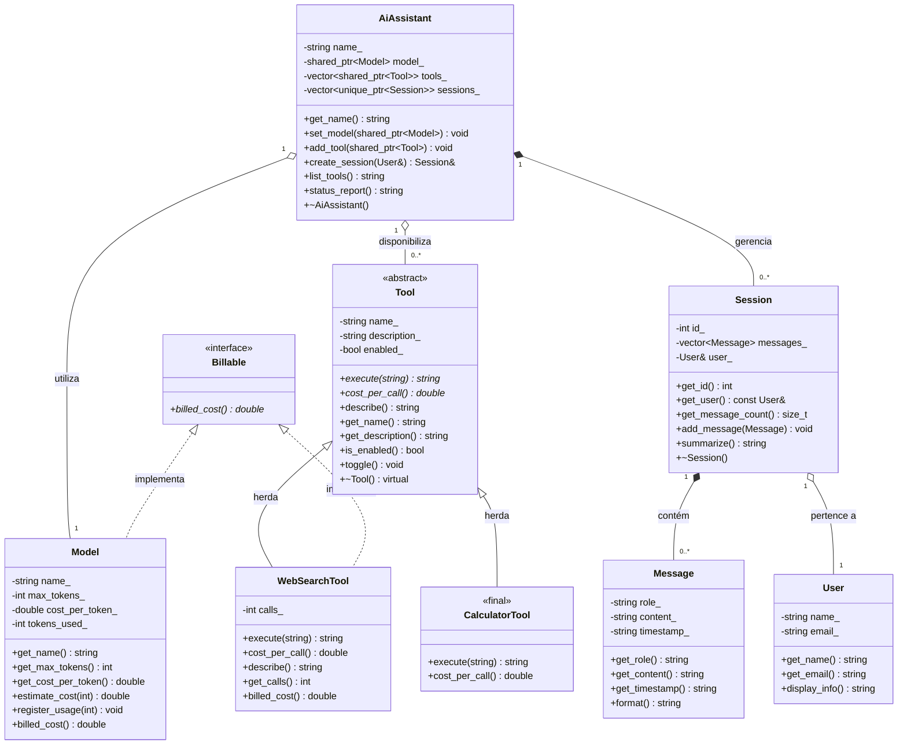

# Sistema de Serviço de LLM

**Nome:** Eduardo de Oliveira Silva
**Matrícula:** 20250018691

## Descrição do Domínio

Este projeto modela um sistema de serviço de Large Language Models (LLMs).
O sistema modela um assistente de IA baseado em LLM. Um `AiAssistant` coordena
pedidos do usuário utilizando um `Model` de linguagem e um conjunto de `Tool`s.
Cada sessão de uso (`Session`) pertence a um `User` e armazena um histórico de
`Message`s trocadas. As relações incluem composição (mensagens dentro de sessões,
ferramentas dentro do assistente) e agregação (modelo e usuário referenciados).

## Diagrama UML de Classes

## Composição e Agregação (Questão 3)

### Relações de Composição (◆)

- **AiAssistant ◆── Session**: composição — o `AiAssistant` cria as sessões internamente
  (`create_session`) e as destrói no seu destrutor (`~AiAssistant`). Uma `Session` não
  existe sem o `AiAssistant` que a criou; seu ciclo de vida é controlado inteiramente pelo dono.

- **Session ◆── Message**: composição — as mensagens são armazenadas por valor dentro do
  `vector<Message>` da `Session`. Quando a `Session` é destruída, todas as suas mensagens
  são automaticamente destruídas junto. Uma `Message` não existe fora da `Session` que a contém.

### Relações de Agregação (◇)

- **AiAssistant ◇── Model**: agregação — o `AiAssistant` apenas referencia (`Model*`) um
  modelo que existe independentemente. O destrutor do assistente **não** deleta o modelo,
  pois este pode continuar existindo após o assistente ser destruído.

- **AiAssistant ◇── Tool**: agregação — o `AiAssistant` mantém ponteiros (`vector<Tool*>`)
  para ferramentas criadas externamente. O destrutor do assistente **não** deleta as
  ferramentas, que continuam existindo de forma independente.

- **Session ◇── User**: agregação — a `Session` referencia (`User*`) um usuário que existe
  independentemente. O destrutor da sessão **não** deleta o usuário, pois este pode
  participar de outras sessões ou continuar existindo após o encerramento.

## Hierarquia de Herança (TP2 — Questão 1)

- **`Tool`** é uma classe **abstrata** que define o contrato para qualquer ferramenta: `execute()` e `cost_per_call()` são métodos **puros** (virtuais sem implementação), enquanto `describe()` é **virtual não-puro** e oferece uma implementação padrão que derivadas podem estender. O **destrutor é virtual**, permitindo que derivadas executem suas lógicas de limpeza antes do destrutor da base.

- **`WebSearchTool`** é uma subclasse concreta que sobrescreve todos os métodos puros e, no método `describe()`, chama explicitamente `Tool::describe()` para reutilizar a descrição base antes de complementá-la com informações de estado (número de buscas realizadas).

- **`CalculatorTool`** é uma subclasse concreta marcada com a palavra-chave `final` (classe folha), impedindo futuras especializações. Implementa os contratos abstratos sem estender `describe()`, usando apenas a descrição padrão da base.

## Smart Pointers (Questão 4)

- **`AiAssistant::sessions_`** → `vector<unique_ptr<Session>>`: composição — o assistente é dono exclusivo das sessões, então `unique_ptr` expressa posse única e elimina `delete` manual.
- **`AiAssistant::model_`** → `shared_ptr<Model>`: agregação — o assistente compartilha a posse do modelo com outras possíveis entidades (recurso genuinamente compartilhado). O `shared_ptr` garante que o modelo não seja destruído enquanto o assistente ou outra entidade ainda o utilizar.
- **`AiAssistant::tools_`** → `vector<shared_ptr<Tool>>`: agregação — o assistente compartilha a posse das ferramentas, que podem ser reutilizadas por outros assistentes. O `shared_ptr` gerencia essa posse compartilhada.
- **`Session::user_`** → `User&` (referência): agregação — a sessão apenas observa o usuário sem possuí-lo; referência expressa observador sem posse e garante que o usuário sempre existe.

## Herança Avançada (TP2 — Questão 3)

- **Interface pura `Billable`**: sem estado, apenas `billed_cost() = 0` e destrutor
  virtual. Modela a *capacidade* de gerar custo, implementada tanto dentro da
  hierarquia de `Tool` (`WebSearchTool`) quanto fora dela (`Model`).
- **Herança múltipla segura**: `WebSearchTool : public Tool, public Billable` —
  pública nos dois casos e sem diamante, pois `Billable` não carrega estado.
- **`final` em `CalculatorTool`**: a calculadora é uma folha concreta e completa da
  hierarquia — seu contrato (avaliar expressões com custo fixo) não admite
  especialização. Marcar a classe como `final` garante em tempo de compilação que
  ninguém herde dela para alterar esse comportamento (qualquer tentativa gera erro
  "cannot derive from final"), documenta a intenção de design e permite ao
  compilador devirtualizar chamadas quando o tipo estático é `CalculatorTool`.

## Programação Genérica (TP3 — Questão 1)

- **Template `Catalog<T>`** (`catalog.hpp`): abstrai a ideia de um *registro
  pesquisável por nome* sobre qualquer tipo do domínio — não é um `vector`
  disfarçado, pois adiciona a operação `find_by_name()` (retornando
  `std::optional<T>`) que um `vector` não oferece. É instanciado com dois
  tipos diferentes em `main()`: `Catalog<Model>` e `Catalog<User>`, ambos
  aceitos por já exporem `get_name()`.

- **CRTP em vez de herança virtual**: `Message` e `Session` ganham contagem
  de instâncias (`InstanceCounted<Derived>`) e clonagem textual
  (`TextualClonable<Derived>`) via CRTP (`crtp_mixins.hpp`). Diferente de
  `Tool` — que precisa de despacho em tempo de execução porque o código
  cliente não conhece o tipo concreto ao iterar `vector<unique_ptr<Tool>>` —
  aqui o tipo derivado é sempre conhecido em tempo de compilação
  (`Message`/`Session` nunca são acessados por ponteiro/referência à base).
  Uma hierarquia virtual pagaria o custo de uma vtable e uma indireção por
  chamada sem necessidade; o CRTP resolve o `static_cast<const Derived&>`
  em tempo de compilação, sem vtable.

- **Concept `nameable`**: restringe `Catalog<T>` a tipos com
  `get_name() -> convertible_to<std::string>`. Instanciar `Catalog<int>`
  produz um erro de compilação citando diretamente `nameable` (testado com
  `clang++ -std=c++20 -fsyntax-only`), em vez de uma cascata de erros de
  template sem relação clara com a causa.

- **Pipeline de ranges**: `AiAssistant::affordable_tool_names(max_cost)`
  encadeia `views::filter` (ferramentas ativas dentro do orçamento) e
  `views::transform` (extrai o nome). Antes (laço tradicional, como em
  `list_tools()`): um `for` acumulando uma `std::string` com condicionais
  intercaladas. Depois (ranges): a intenção — filtrar, depois projetar —
  fica explícita na composição dos adaptadores, sem vetor intermediário
  para o resultado filtrado.

## STL e Concorrência (TP3 — Questão 3)

- **Containers**: `std::map<string, shared_ptr<Tool>>` (`index_tools_by_name`,
  em `tool_utils.hpp`) indexa ferramentas por nome — escolhido por manter
  ordenação alfabética útil para exibição determinística. `std::unordered_set
  <string>` (`Session::distinct_roles`) coleta os papéis distintos das
  mensagens de uma sessão — escolhido pelo acesso/inserção O(1) e por a
  ordem não importar, só a unicidade.
- **Algoritmos**: `find_if` (busca por nome), `sort` (ordena por custo, com
  comparador lambda), `count_if` (conta acima de um limiar, com lambda que
  **captura** o limiar) e `accumulate` (soma o custo total) — todos em
  `tool_utils.hpp`, evitando laços manuais equivalentes.
- **Concorrência**: `estimate_batches_parallel` (`concurrent_billing.hpp`)
  dispara um `std::async` por lote de tokens. É seguro paralelizar porque
  `Model::estimate_cost` é `const` e cada lote não depende dos demais — o
  único estado compartilhado é a trilha de auditoria (`audit_trail`),
  protegida por `std::mutex`/`std::lock_guard`; os resultados são coletados
  via `future::get()`.
- **ThreadSanitizer**: `clang++ -std=c++20 -pthread -fsanitize=thread -Isrc
  src/main.cpp -o tsan_app && ./tsan_app` roda limpo, sem nenhuma linha
  `WARNING: ThreadSanitizer` — confirma que o único estado mutável
  compartilhado entre as threads (`audit_trail`) está corretamente
  protegido pelo mutex.
